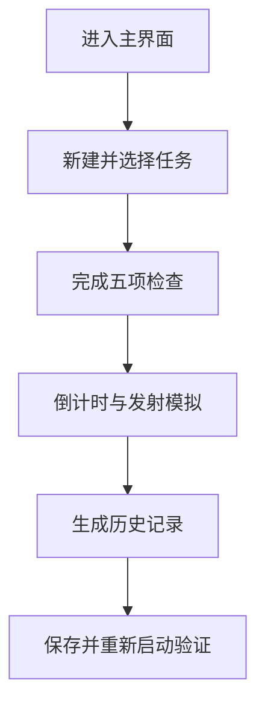

# 星箭计划：Codex 独立执行规格书

版本：1.0  
目标平台：Visual Studio 2022、C++、MFC 对话框应用程序、Unicode、Windows 10/11

## 1. 文档用途

本文件是 Codex 的唯一执行依据。项目名称固定为 `SpaceLaunchSystem`，主题为“星箭计划——航天发射任务管理与模拟系统”。

不要把整个项目一次性交给 Codex 连续执行。必须按本文阶段顺序逐关执行：每个阶段完成、编译和验收后，才允许开始下一阶段。同一阶段最多修复两轮；仍不能通过时停止并报告，不允许继续猜测或扩大修改范围。

## 2. 最终目标

交付一个可在 Windows 上运行的 MFC 对话框应用，完成以下闭环：

1. 新建、修改、删除和选择航天任务。
2. 对当前任务执行五项发射前检查。
3. 五项检查全部通过后，进入倒计时和发射模拟。
4. 发射完成或中止后自动生成历史记录。
5. 任务、检查结果和历史记录能够保存到本地文件，并在下次启动时恢复。
6. 有未保存更改时关闭窗口，弹出中文“保存/不保存/取消”提示。
7. Debug x64 和 Release x64 均能成功生成；Release 版本可打包演示。

最终演示流程固定为：



## 3. 范围冻结

### 3.1 必须实现

- 主界面导航与当前任务摘要。
- 任务管理：添加、修改、删除、选择、保存。
- 发射检查：推进、导航、通信、电源、天气五项布尔检查和备注。
- 发射模拟：10 秒倒计时、进度、燃料、高度、速度、日志、暂停、中止、重置。
- 历史记录：列表、关键词筛选、结果筛选、查看详情、删除、导出。
- 本地 UTF-8 TSV 文件持久化。
- 未保存关闭提示和基本输入校验。

### 3.2 明确不做

- 不联网，不调用天气、地图或航天数据 API。
- 不使用数据库、JSON 库、第三方 UI 库或第三方图表库。
- 不做账号登录、权限系统、多用户协作或云同步。
- 不做三维动画、真实轨道力学、地图轨迹、音视频播放。
- 不做自定义窗口皮肤、无边框窗口、复杂绘图和高 DPI 专项适配。
- 不引入 MVC/MVVM、依赖注入、插件系统或模板元编程。
- 不重命名向导生成的应用类、主对话框类和主资源 ID。
- 不清理与任务无关的警告，不进行“顺便重构”。

如需增加以上任一功能，必须先得到用户明确批准，并另开后续版本。

## 4. 开始前必须准备的环境

### 4.1 人工只做一次的准备

1. 安装 Visual Studio 2022。
2. 安装“使用 C++ 的桌面开发”工作负载。
3. 勾选当前版本的 MFC、Windows SDK 和 MSVC x64/x86 工具。
4. 用 MFC 应用向导创建项目：
   - 项目名：`SpaceLaunchSystem`
   - 应用程序类型：基于对话框
   - 字符集：Unicode
   - 目标平台：x64
5. 不删除向导生成的主对话框、`CAboutDlg`、图标和资源文件。
6. 在没有任何自定义代码时先生成一次 Debug x64，确认成功。
7. 初始化 Git，并提交基线：`chore: create MFC dialog baseline`。

> 从此处开始才交给 Codex。不要让 Codex 从零手写 MFC 工程文件，因为这一步对 Visual Studio 安装版本和模板高度敏感，收益低、风险高。

### 4.2 固定目录

项目根目录中最终只增加下列文件和目录；不要随意换名：

```text
SpaceLaunchSystem/
├─ SpaceLaunchSystem.sln
├─ SpaceLaunchSystem/
│  ├─ SpaceLaunchSystemDlg.h
│  ├─ SpaceLaunchSystemDlg.cpp
│  ├─ SpaceLaunchSystem.rc
│  ├─ resource.h
│  ├─ DataTypes.h
│  ├─ DataTypes.cpp
│  ├─ DataManager.h
│  ├─ DataManager.cpp
│  ├─ MissionManagerDlg.h
│  ├─ MissionManagerDlg.cpp
│  ├─ MissionEditDlg.h
│  ├─ MissionEditDlg.cpp
│  ├─ LaunchCheckDlg.h
│  ├─ LaunchCheckDlg.cpp
│  ├─ LaunchSimulationDlg.h
│  ├─ LaunchSimulationDlg.cpp
│  ├─ HistoryDlg.h
│  └─ HistoryDlg.cpp
├─ docs/
│  ├─ CODEX_EXECUTION_SPEC.md
│  ├─ TEST_CHECKLIST.md
│  └─ screenshots/
└─ package/
```

程序首次运行时自动在 EXE 同级创建 `data` 目录：

```text
data/
├─ missions.tsv
├─ checks.tsv
└─ launch_records.tsv
```

## 5. 命名总规则

| 对象 | 规则 | 示例 |
|---|---|---|
| 类 | PascalCase，以 `C` 开头 | `CLaunchCheckDlg` |
| 成员变量 | `m_` + camelCase | `m_currentMissionId` |
| 局部变量 | camelCase | `selectedIndex` |
| 对话框资源 | `IDD_*_DIALOG` | `IDD_HISTORY_DIALOG` |
| 按钮 | `IDC_BUTTON_*` | `IDC_BUTTON_MISSION_ADD` |
| 编辑框 | `IDC_EDIT_*` | `IDC_EDIT_MISSION_NAME` |
| 列表 | `IDC_LIST_*` | `IDC_LIST_MISSIONS` |
| 复选框 | `IDC_CHECK_*` | `IDC_CHECK_WEATHER` |
| 组合框 | `IDC_COMBO_*` | `IDC_COMBO_DESTINATION` |
| 进度条 | `IDC_PROGRESS_*` | `IDC_PROGRESS_LAUNCH` |
| 静态文本 | `IDC_STATIC_*` | `IDC_STATIC_COUNTDOWN` |
| 消息函数 | `OnBnClicked...` | `OnBnClickedMissionAdd` |

所有源文件使用 UTF-8 with BOM 或 Visual Studio 默认 Unicode 兼容编码。代码缩进使用 Tab 或 4 个空格，但单个文件中必须一致。注释只保留业务目的和不明显的边界条件，不写逐行教学式注释。

## 6. 数据模型：名称与字段不得更改

`DataTypes.h` 中只定义枚举、结构体和转换函数声明；`DataTypes.cpp` 实现转换函数。

```cpp
enum class MissionStatus
{
    Planned,
    Ready,
    Launching,
    Completed,
    Aborted
};

enum class LaunchState
{
    Idle,
    Countdown,
    Ascending,
    Paused,
    Completed,
    Aborted
};

struct MissionInfo
{
    CString missionId;
    CString missionName;
    CString rocketName;
    CString payloadName;
    CString destination;
    CString launchTime;
    MissionStatus status = MissionStatus::Planned;
};

struct CheckResult
{
    CString missionId;
    BOOL propulsionReady = FALSE;
    BOOL navigationReady = FALSE;
    BOOL communicationReady = FALSE;
    BOOL powerReady = FALSE;
    BOOL weatherReady = FALSE;
    CString remarks;
};

struct LaunchRecord
{
    CString missionId;
    CString missionName;
    CString launchTime;
    CString result;
    double maxHeightKm = 0.0;
    CString description;
};

CString MissionStatusToString(MissionStatus status);
BOOL StringToMissionStatus(const CString& text, MissionStatus& status);
```

规则：

- `missionId` 是唯一主键，区分大小写。
- 字段不允许包含制表符、回车或换行；输入时提示用户修改。
- `launchTime` 固定格式为 `YYYY-MM-DD HH:MM`，只做格式校验，不解析时区。
- `LaunchRecord.result` 只允许 `成功` 或 `已中止`。
- 金额、密码、用户信息均不属于本项目。

## 7. 数据管理类：公开接口固定

`CDataManager` 只负责内存数据和文件读写，不访问控件。

```cpp
class CDataManager
{
public:
    BOOL Initialize();
    BOOL LoadAll();
    BOOL SaveAll();

    std::vector<MissionInfo>& GetMissions();
    const std::vector<MissionInfo>& GetMissions() const;
    const std::vector<LaunchRecord>& GetRecords() const;

    MissionInfo* FindMission(const CString& missionId);
    const MissionInfo* FindMission(const CString& missionId) const;
    CheckResult* FindCheckResult(const CString& missionId);

    BOOL AddMission(const MissionInfo& mission, CString& errorMessage);
    BOOL UpdateMission(const CString& originalId,
        const MissionInfo& mission, CString& errorMessage);
    BOOL DeleteMission(const CString& missionId);
    void SetCheckResult(const CheckResult& result);
    void AddLaunchRecord(const LaunchRecord& record);
    BOOL DeleteLaunchRecord(size_t index);

    BOOL IsModified() const;
    void MarkModified();
    void MarkSaved();
    BOOL ConfirmSaveBeforeClose(CWnd* pOwner);

private:
    std::vector<MissionInfo> m_missions;
    std::vector<CheckResult> m_checkResults;
    std::vector<LaunchRecord> m_records;
    CString m_dataDirectory;
    BOOL m_isModified = FALSE;
};
```

实现约束：

- `Initialize()` 使用 `GetModuleFileName` 获取 EXE 目录，创建 `data` 目录，再调用 `LoadAll()`。
- 文件统一使用 UTF-8，不写 UTF-16。Codex 可用 `CFile` 配合 `CW2A/CA2W` 完成转换。
- TSV 一行一条记录，字段用一个 `\t` 分隔。
- `missions.tsv` 字段顺序固定：任务 ID、任务名、火箭、载荷、目的地、发射时间、状态。
- `checks.tsv` 字段顺序固定：任务 ID、五个 `0/1`、备注。
- `launch_records.tsv` 字段顺序固定：任务 ID、任务名、发射时间、结果、最大高度、描述。
- 文件不存在视为首次运行，不报错；文件存在但某行字段数错误时跳过该行，其余行继续读。
- `SaveAll()` 必须先写临时文件，三份文件全部成功后再替换正式文件，避免部分写入。
- 所有增删改都调用 `MarkModified()`；成功保存后调用 `MarkSaved()`。
- 未修改时关闭不提示；已修改时显示中文 `MB_YESNOCANCEL | MB_ICONQUESTION`。
- 选择“是”且保存成功才关闭；选择“否”直接关闭；选择“取消”保留窗口。

## 8. 对话框、控件和成员变量清单

### 8.1 主对话框

保留向导名称：

- 类：`CSpaceLaunchSystemDlg`
- 资源：`IDD_SPACELAUNCHSYSTEM_DIALOG`
- 文件：`SpaceLaunchSystemDlg.h/.cpp`

成员：

```cpp
CDataManager m_dataManager;
CString m_currentMissionId;
```

控件：

| ID | 类型 | Caption/用途 |
|---|---|---|
| `IDC_STATIC_APP_TITLE` | Static Text | 星箭计划 |
| `IDC_STATIC_CURRENT_MISSION` | Static Text | 当前任务摘要 |
| `IDC_STATIC_SYSTEM_STATUS` | Static Text | 系统状态 |
| `IDC_BUTTON_MISSION_MANAGER` | Button | 任务管理 |
| `IDC_BUTTON_LAUNCH_CHECK` | Button | 发射检查 |
| `IDC_BUTTON_LAUNCH_SIMULATION` | Button | 发射模拟 |
| `IDC_BUTTON_HISTORY` | Button | 历史记录 |

函数：

```cpp
void RefreshMainSummary();
afx_msg void OnBnClickedMissionManager();
afx_msg void OnBnClickedLaunchCheck();
afx_msg void OnBnClickedLaunchSimulation();
afx_msg void OnBnClickedHistory();
afx_msg void OnClose();
```

行为：初始化数据；没有当前任务时禁用“发射检查”和“发射模拟”；从任务管理返回后刷新摘要；关闭时统一调用 `m_dataManager.ConfirmSaveBeforeClose(this)`。

### 8.2 任务管理对话框

- 类：`CMissionManagerDlg`
- 资源：`IDD_MISSION_MANAGER_DIALOG`
- 文件：`MissionManagerDlg.h/.cpp`
- 显示方式：`DoModal()`

构造函数：

```cpp
CMissionManagerDlg(CDataManager* pDataManager,
    CString* pCurrentMissionId,
    CWnd* pParent = nullptr);
```

成员：

```cpp
CDataManager* m_pDataManager = nullptr;
CString* m_pCurrentMissionId = nullptr;
CListCtrl m_missionList;
```

控件：

| ID | 类型 | Caption/用途 |
|---|---|---|
| `IDC_LIST_MISSIONS` | List Control, Report | 七列任务表格 |
| `IDC_BUTTON_MISSION_ADD` | Button | 添加 |
| `IDC_BUTTON_MISSION_MODIFY` | Button | 修改 |
| `IDC_BUTTON_MISSION_DELETE` | Button | 删除 |
| `IDC_BUTTON_MISSION_SELECT` | Button | 设为当前任务 |
| `IDC_BUTTON_MISSION_SAVE` | Button | 保存 |

函数：

```cpp
void RefreshMissionList();
int GetSelectedMissionIndex() const;
afx_msg void OnBnClickedMissionAdd();
afx_msg void OnBnClickedMissionModify();
afx_msg void OnBnClickedMissionDelete();
afx_msg void OnBnClickedMissionSelect();
afx_msg void OnBnClickedMissionSave();
```

列表列固定为：任务 ID、任务名称、运载火箭、载荷、目的地、计划时间、状态。删除必须二次确认；删除当前任务后清空 `m_currentMissionId`。

### 8.3 任务编辑对话框

- 类：`CMissionEditDlg`
- 资源：`IDD_MISSION_EDIT_DIALOG`
- 文件：`MissionEditDlg.h/.cpp`
- 显示方式：`DoModal()`

公开成员作为输入输出：

```cpp
MissionInfo m_mission;
BOOL m_isModifyMode = FALSE;
```

控件：

| ID | 类型 | Caption/用途 |
|---|---|---|
| `IDC_EDIT_MISSION_ID` | Edit Control | 任务 ID |
| `IDC_EDIT_MISSION_NAME` | Edit Control | 任务名称 |
| `IDC_EDIT_ROCKET_NAME` | Edit Control | 运载火箭 |
| `IDC_EDIT_PAYLOAD_NAME` | Edit Control | 载荷名称 |
| `IDC_COMBO_DESTINATION` | Combo Box | 近地轨道/月球/火星/空间站 |
| `IDC_EDIT_LAUNCH_TIME` | Edit Control | `YYYY-MM-DD HH:MM` |
| `IDOK` | Button | 确定 |
| `IDCANCEL` | Button | 取消 |

函数：

```cpp
virtual BOOL OnInitDialog();
virtual void OnOK();
BOOL ValidateInput(CString& errorMessage) const;
```

校验顺序固定：空字段、非法制表符或换行、时间格式。唯一性由 `CDataManager` 检查。修改模式下任务 ID 控件设为只读，避免级联修改检查和历史记录。

### 8.4 发射检查对话框

- 类：`CLaunchCheckDlg`
- 资源：`IDD_LAUNCH_CHECK_DIALOG`
- 文件：`LaunchCheckDlg.h/.cpp`
- 显示方式：`DoModal()`

构造函数：

```cpp
CLaunchCheckDlg(CDataManager* pDataManager,
    const CString& missionId,
    CWnd* pParent = nullptr);
```

成员：

```cpp
CDataManager* m_pDataManager = nullptr;
CString m_missionId;
BOOL m_propulsionReady = FALSE;
BOOL m_navigationReady = FALSE;
BOOL m_communicationReady = FALSE;
BOOL m_powerReady = FALSE;
BOOL m_weatherReady = FALSE;
CString m_remarks;
CProgressCtrl m_readinessProgress;
```

控件：

| ID | 类型 | Caption/用途 |
|---|---|---|
| `IDC_STATIC_CHECK_MISSION` | Static Text | 当前任务 |
| `IDC_CHECK_PROPULSION` | Check Box | 推进系统 |
| `IDC_CHECK_NAVIGATION` | Check Box | 导航系统 |
| `IDC_CHECK_COMMUNICATION` | Check Box | 通信系统 |
| `IDC_CHECK_POWER` | Check Box | 电源系统 |
| `IDC_CHECK_WEATHER` | Check Box | 天气条件 |
| `IDC_EDIT_CHECK_REMARKS` | Multiline Edit | 检查备注 |
| `IDC_PROGRESS_READINESS` | Progress Control | 0–100 |
| `IDC_STATIC_READINESS` | Static Text | 就绪百分比 |
| `IDC_BUTTON_CHECK_ALL_PASS` | Button | 全部通过 |
| `IDC_BUTTON_CHECK_SAVE` | Button | 保存检查 |
| `IDC_BUTTON_ENTER_SIMULATION` | Button | 进入发射模拟 |

函数：

```cpp
void RefreshReadiness();
BOOL AreAllChecksPassed() const;
afx_msg void OnCheckChanged();
afx_msg void OnBnClickedCheckAllPass();
afx_msg void OnBnClickedCheckSave();
afx_msg void OnBnClickedEnterSimulation();
```

每项占 20%。全部通过后任务状态改为 `Ready`；任一项未通过时任务状态保持或回到 `Planned`。只有全部通过才能进入模拟。

### 8.5 发射模拟对话框

- 类：`CLaunchSimulationDlg`
- 资源：`IDD_LAUNCH_SIMULATION_DIALOG`
- 文件：`LaunchSimulationDlg.h/.cpp`
- 显示方式：`DoModal()`

构造函数：

```cpp
CLaunchSimulationDlg(CDataManager* pDataManager,
    const CString& missionId,
    CWnd* pParent = nullptr);
```

成员：

```cpp
static constexpr UINT_PTR TIMER_LAUNCH = 1;
CDataManager* m_pDataManager = nullptr;
CString m_missionId;
LaunchState m_launchState = LaunchState::Idle;
int m_countdown = 10;
int m_progress = 0;
double m_altitudeKm = 0.0;
double m_speedKmh = 0.0;
BOOL m_recordCreated = FALSE;
CProgressCtrl m_launchProgress;
CProgressCtrl m_fuelProgress;
```

控件：

| ID | 类型 | Caption/用途 |
|---|---|---|
| `IDC_STATIC_SIM_MISSION` | Static Text | 当前任务 |
| `IDC_STATIC_COUNTDOWN` | Static Text | 倒计时 |
| `IDC_PROGRESS_LAUNCH` | Progress Control | 发射进度 |
| `IDC_PROGRESS_FUEL` | Progress Control | 剩余燃料 |
| `IDC_STATIC_ALTITUDE` | Static Text | 高度 km |
| `IDC_STATIC_SPEED` | Static Text | 速度 km/h |
| `IDC_STATIC_STAGE` | Static Text | 当前阶段 |
| `IDC_EDIT_LAUNCH_LOG` | Read-only Multiline Edit | 事件日志 |
| `IDC_BUTTON_LAUNCH_START` | Button | 开始/继续 |
| `IDC_BUTTON_LAUNCH_PAUSE` | Button | 暂停 |
| `IDC_BUTTON_LAUNCH_ABORT` | Button | 中止 |
| `IDC_BUTTON_LAUNCH_RESET` | Button | 重置 |

函数：

```cpp
void ResetSimulation();
void RefreshSimulationDisplay();
void AppendLog(const CString& message);
void CompleteLaunch();
void AbortLaunch();
afx_msg void OnTimer(UINT_PTR timerId);
afx_msg void OnBnClickedLaunchStart();
afx_msg void OnBnClickedLaunchPause();
afx_msg void OnBnClickedLaunchAbort();
afx_msg void OnBnClickedLaunchReset();
```

固定模拟算法：

- 定时器间隔 1000 ms。
- `Countdown` 状态每次将 `m_countdown` 减 1；到 0 后进入 `Ascending`。
- `Ascending` 每次将 `m_progress` 加 5，最大 100。
- `ratio = m_progress / 100.0`。
- `m_altitudeKm = 500.0 * ratio * ratio`。
- `m_speedKmh = 28000.0 * ratio`。
- 燃料百分比为 `100 - m_progress`。
- 100% 时任务状态变为 `Completed`，且只创建一条“成功”记录。
- 中止前二次确认；中止后状态为 `Aborted`，且只创建一条“已中止”记录。
- 暂停只停止数值推进，不销毁当前状态；重置只允许在未完成或未中止时进行。

### 8.6 历史记录对话框

- 类：`CHistoryDlg`
- 资源：`IDD_HISTORY_DIALOG`
- 文件：`HistoryDlg.h/.cpp`
- 显示方式：`DoModal()`

成员：

```cpp
CDataManager* m_pDataManager = nullptr;
CListCtrl m_historyList;
CString m_keyword;
int m_resultFilter = 0;
std::vector<size_t> m_visibleRecordIndexes;
```

控件：

| ID | 类型 | Caption/用途 |
|---|---|---|
| `IDC_LIST_HISTORY` | List Control, Report | 历史表格 |
| `IDC_EDIT_HISTORY_KEYWORD` | Edit Control | 关键词 |
| `IDC_COMBO_HISTORY_RESULT` | Combo Box | 全部/成功/已中止 |
| `IDC_BUTTON_HISTORY_SEARCH` | Button | 筛选 |
| `IDC_BUTTON_HISTORY_DETAIL` | Button | 查看详情 |
| `IDC_BUTTON_HISTORY_DELETE` | Button | 删除 |
| `IDC_BUTTON_HISTORY_EXPORT` | Button | 导出 |
| `IDC_EDIT_HISTORY_DETAIL` | Read-only Multiline Edit | 详情 |

函数：

```cpp
void RefreshHistoryList();
int GetSelectedVisibleIndex() const;
afx_msg void OnBnClickedHistorySearch();
afx_msg void OnBnClickedHistoryDetail();
afx_msg void OnBnClickedHistoryDelete();
afx_msg void OnBnClickedHistoryExport();
```

列表列固定为：任务 ID、任务名称、时间、结果、最大高度。筛选只影响显示，不修改原数据。导出使用 `CFileDialog`，写出 UTF-8 TSV。

## 9. 资源文件修改规则

MFC 的 `.rc` 和 `resource.h` 是本项目最高风险文件，Codex 必须遵守：

1. 修改前先确认 Git 工作区状态和基线可生成。
2. 不删除 `IDD_ABOUTBOX`、主对话框、字符串表、图标、版本信息和 `AFX_` 块。
3. 新 ID 优先由 Visual Studio 资源编辑器生成；若 Codex 直接编辑，必须先读取 `resource.h` 的现有数值，使用未占用连续区间。
4. 同一个符号只定义一次；同一个数字不能分配给两个需要独立消息的控件。
5. 对话框模板只添加本文清单中的控件，不追求像素级还原草图。
6. 每新增一个对话框，立刻生成一次，不要等所有资源改完再编译。
7. 如果出现 `RC` 编译错误、资源编辑器无法打开或控件 ID 冲突，立即停止本阶段；不得通过重写整个 `.rc` 文件解决。

建议界面统一：深蓝标题、浅色内容区、普通系统按钮，优先可读性和稳定性。MVP 使用系统默认字体和控件，不实现自绘。

## 10. 消息映射和 DDX 规则

- 字符串变量使用 `DDX_Text`，控件对象使用 `DDX_Control`；二者不可混用。
- `CString` 不能传给 `DDX_Control`，`CEdit/CListCtrl/CProgressCtrl` 不能传给 `DDX_Text`。
- 每个按钮函数必须同时具备：头文件声明、消息映射项、CPP 定义。
- 读取用户输入前调用 `UpdateData(TRUE)`；修改成员字符串并回写控件时调用 `UpdateData(FALSE)`。
- `OnInitDialog()` 中先调用基类，再初始化 Combo/List/Progress，最后显示数据。
- 模态窗口全部使用局部对象和 `DoModal()`，不使用 `new`。
- 定时器窗口关闭前必须 `KillTimer(TIMER_LAUNCH)`。
- `OnClose()`、`OnCancel()` 只保留一个统一的保存询问入口，避免弹两次。

## 11. 分阶段执行与验收门

### 阶段 0：只读体检

允许：读取文件、执行 Git 状态和生成命令。  
禁止：修改任何文件。

Codex 输出：

- 解决方案、项目、主类、主资源 ID 的实际名称。
- Visual Studio/MFC/MSBuild 是否可用。
- Debug x64 基线生成结果。
- 与本文预设是否有冲突。

验收门：基线必须成功生成；否则停止。

### 阶段 1：复制规格和建立数据层

动作：

1. 将本文件复制为 `docs/CODEX_EXECUTION_SPEC.md`。
2. 添加 `DataTypes.h/.cpp`、`DataManager.h/.cpp`。
3. 在项目文件中登记四个文件。
4. 不修改 UI 和 `.rc`。
5. 生成 Debug x64。

验收：无编译错误；用临时调试代码或最小测试验证空数据目录可初始化，然后移除临时代码。

### 阶段 2：资源和空对话框类

按以下次序一次只添加一个资源和类：

1. `CMissionEditDlg`
2. `CMissionManagerDlg`
3. `CLaunchCheckDlg`
4. `CLaunchSimulationDlg`
5. `CHistoryDlg`

每添加一个就生成一次。此阶段只要求控件存在、DDX 正确、对话框可以空白打开，不写业务逻辑。

验收：五个对话框均能从临时调试入口打开，关闭正常；随后移除临时入口。

### 阶段 3：主界面导航

动作：给主界面添加四个按钮和两个摘要文本；接入 `CDataManager`；按钮分别打开五个对话框中的相应窗口。

验收：首次启动不报错；四个入口均可打开和关闭；无当前任务时检查和模拟按钮禁用。

### 阶段 4：任务 CRUD

实现任务列表、编辑弹窗、唯一 ID 校验、删除确认、选择当前任务和保存。

验收用例：

1. 添加任务 `M001 / 嫦娥演示任务 / 长征五号 / 月球探测器 / 月球 / 2026-10-01 08:30`。
2. 重复添加 `M001` 必须提示失败。
3. 修改任务名后列表立即更新。
4. 选择任务后主界面显示 `M001`。
5. 保存、关闭、重启后任务仍存在。

### 阶段 5：发射检查

实现五项检查、20% 进度计算、备注保存、全部通过和进入模拟限制。

验收：四项通过显示 80%；不能进入模拟；五项通过显示 100%，任务状态为 `Ready`，重启后检查结果仍存在。

### 阶段 6：发射模拟

严格使用第 8.5 节算法，不设计真实物理模型。

验收：

- 未完成检查的任务不能打开模拟。
- 倒计时从 10 到 0，每秒更新一次。
- 暂停后数值不变，继续后恢复。
- 完成后只生成一条成功记录。
- 中止后只生成一条中止记录。
- 反复单击按钮不会生成重复记录或多个定时器。

### 阶段 7：历史记录

实现列表、关键词筛选、结果筛选、详情、删除和导出。

验收：筛选前后删除的都是正确原记录；导出的 UTF-8 文件可用记事本打开；重启后历史仍存在。

### 阶段 8：关闭保存与完整联调

把所有未保存提示统一到 `CDataManager::ConfirmSaveBeforeClose()`；检查主窗口 X、Esc、Cancel 路径，不得重复提示。

完整执行第 2 节演示闭环，并将结果写入 `docs/TEST_CHECKLIST.md`。

### 阶段 9：Release 打包

1. 生成 Release x64。
2. 若课程电脑未安装 VC 运行库，项目属性改为 Release 的 `/MT`，MFC 使用静态库，然后重新生成。
3. `package` 中只放 EXE、空的 `data` 目录、README 和必要资源；不放 PDB、中间文件或源码副本。
4. 在另一台 Windows 电脑或干净虚拟机上测试启动、保存和重启。

验收：双击 EXE 可运行；程序目录可写；保存文件可恢复。

## 12. Codex 额度与失败控制

### 12.1 每阶段固定动作

1. 读取本阶段涉及的文件，不扫描无关目录。
2. 用不超过 8 行列出本阶段将修改的文件和验收标准。
3. 检查 Git 工作区，保留用户已有修改。
4. 只修改本阶段文件。
5. 批量完成一个逻辑单元后生成一次。
6. 根据首个真实编译错误修复，最多两轮。
7. 通过后输出：修改文件、生成结果、人工点击测试、剩余风险。
8. 停止，等待用户明确下达下一阶段指令。

### 12.2 严禁的低效行为

- 不反复全仓库扫描，不在每次思考后重新读取同一文件。
- 不搜索互联网，除非编译错误明确涉及微软 MFC API 且本地头文件不能解释。
- 不输出所有文件的完整代码到聊天；直接编辑文件，只报告关键改动。
- 不为了消除 IntelliSense 假错误而破坏能通过 MSBuild 的代码。
- 不一次处理几十条级联错误；先修复错误列表中最早的根因，再重新生成。
- 不同时重写 `.h`、`.cpp`、`.rc` 和 `.vcxproj` 的大段内容。
- 不自动升级工具集、SDK、语言标准或 NuGet 包。
- 不创建本文之外的类、框架、脚本或数据格式。
- 不用 `git reset --hard`、不覆盖用户修改、不删除未知文件。

### 12.3 必须停止并询问的情况

- 阶段 0 基线无法生成。
- 实际项目名不是 `SpaceLaunchSystem`，且用户不允许重新建基线。
- 工作区存在与本阶段重叠的未提交修改，无法确定归属。
- `.rc` 或 `resource.h` 出现冲突、资源编辑器打不开。
- 同一编译错误修复两轮仍存在。
- 需要安装组件、管理员权限或更改系统环境。
- 需求与本规格矛盾，或必须增加未列出的类/库才能完成。

停止报告必须只包含：已确认事实、首个阻塞错误、已尝试两项修复、建议的一个最小选择。禁止在阻塞后自行换架构。

## 13. 生成命令

优先让 Codex 使用 `vswhere.exe` 找 MSBuild，不硬编码 Visual Studio 版本路径。PowerShell 逻辑：

```powershell
$vswhere = "${env:ProgramFiles(x86)}\Microsoft Visual Studio\Installer\vswhere.exe"
$msbuild = & $vswhere -latest -requires Microsoft.Component.MSBuild -find MSBuild\**\Bin\MSBuild.exe | Select-Object -First 1
& $msbuild .\SpaceLaunchSystem.sln /m /t:Build /p:Configuration=Debug /p:Platform=x64
```

Release：

```powershell
& $msbuild .\SpaceLaunchSystem.sln /m /t:Build /p:Configuration=Release /p:Platform=x64
```

真实构建结果高于 IntelliSense 错误列表。构建日志只需保留首个错误附近内容，不把完整数千行日志贴进对话。

## 14. 最小人工测试清单

| 编号 | 操作 | 预期结果 |
|---|---|---|
| T01 | 首次启动且无 data 文件 | 正常启动、空列表 |
| T02 | 添加合法任务 | 列表新增一行 |
| T03 | 添加重复 ID | 中文提示且不新增 |
| T04 | 修改任务 | 原行更新，不增加行数 |
| T05 | 删除任务并取消 | 数据不变 |
| T06 | 选择当前任务 | 主界面摘要更新 |
| T07 | 勾选四项检查 | 80%，模拟不可进入 |
| T08 | 勾选五项检查 | 100%，状态 Ready |
| T09 | 开始、暂停、继续 | 时间和数值行为正确 |
| T10 | 完成发射 | 只产生一条成功记录 |
| T11 | 中止发射 | 二次确认，只产生一条中止记录 |
| T12 | 历史筛选与删除 | 对应原记录正确变化 |
| T13 | 有修改时关闭并选取消 | 窗口保留 |
| T14 | 有修改时关闭并选是 | 保存后关闭 |
| T15 | 重启程序 | 任务、检查和记录恢复 |
| T16 | Release 在其他电脑运行 | 启动、保存、重启均正常 |

## 15. 给 Codex 的主提示词

第一次只执行阶段 0，使用下面提示：

```text
你正在维护一个 Visual Studio 2022 MFC 项目 SpaceLaunchSystem。
先完整阅读 docs/CODEX_EXECUTION_SPEC.md，并把它视为不可自行更改的执行合同。

本次只执行“阶段 0：只读体检”。
禁止修改文件、禁止自动修复、禁止开始后续阶段。
检查 Git 状态、解决方案结构、主类和资源 ID，并执行 Debug x64 基线生成。
输出四项：实际工程信息、构建结果、与规格冲突、能否进入阶段 1。
如果基线失败，只报告首个真实错误和最小解决建议，然后停止。
```

阶段 0 通过后，每次只替换阶段编号：

```text
完整阅读 docs/CODEX_EXECUTION_SPEC.md。
本次只执行“阶段 N：<阶段名称>”，不得提前做阶段 N+1。
开始前用不超过 8 行列出将修改的文件和验收标准。
严格使用规格中的类名、成员名、资源 ID、数据格式和算法，不增加第三方库或额外功能。
保留用户已有修改；一个逻辑单元完成后再构建。
最多修复两轮。仍失败则按规格停止，不要换架构或继续猜测。
完成后报告修改文件、Debug x64 构建结果、需要我点击验证的步骤和剩余风险，然后停止等待。
```

不要使用“请直接完成整个项目”“自行决定最佳架构”“持续修复直到成功”这类开放式提示。它们会让 Codex扩大范围、反复试错并消耗额度。

## 16. 每阶段建议 Git 提交

| 阶段 | 提交信息 |
|---|---|
| 0 | 不提交 |
| 1 | `feat: add mission data model and persistence` |
| 2 | `feat: add dialog resources and classes` |
| 3 | `feat: add main navigation` |
| 4 | `feat: implement mission management` |
| 5 | `feat: implement launch readiness checks` |
| 6 | `feat: implement launch simulation` |
| 7 | `feat: implement launch history` |
| 8 | `fix: complete save prompts and integration tests` |
| 9 | `build: prepare release package` |

只有当前阶段构建通过、人工冒烟测试通过后才提交。若 Git 尚未配置用户名，停止并让用户配置，不要修改全局 Git 配置。

## 17. 预期工作量

| 模块 | 预计人工监督时间 | 风险 |
|---|---:|---|
| 基线与数据层 | 1–2 小时 | 低 |
| 资源和对话框 | 2–4 小时 | 高 |
| 任务 CRUD | 2–3 小时 | 中 |
| 检查和模拟 | 2–3 小时 | 中 |
| 历史和保存 | 1–2 小时 | 中 |
| 联调与打包 | 2–4 小时 | 中 |

Codex 可承担代码、资源文本修改、构建和错误定位；人只负责创建基线工程、视觉微调、实际点击测试和另一台电脑验证。全自动的合理含义是“每阶段由 Codex 自动编辑并构建”，而不是无人监督地一次跑完整个项目。

## 18. 最终交付判定

只有以下条件全部满足才能称为完成：

- 本文列出的六个对话框和全部固定功能可用。
- 16 项最小人工测试全部通过并记录。
- Debug x64 与 Release x64 均成功生成。
- 关闭保存提示为中文且没有重复弹窗。
- 数据文件可恢复，重复 ID、空输入、非法时间均有提示。
- 定时器关闭干净，历史记录不会重复生成。
- 另一台 Windows 电脑完成运行验证。
- 源码、资源、README、测试清单和 Release 包齐全。

完成 MVP 后若仍有时间，扩展优先级固定为：主界面背景图与图标、历史统计图、模拟音效。任何扩展都必须另建任务，不得混入上述阶段。
